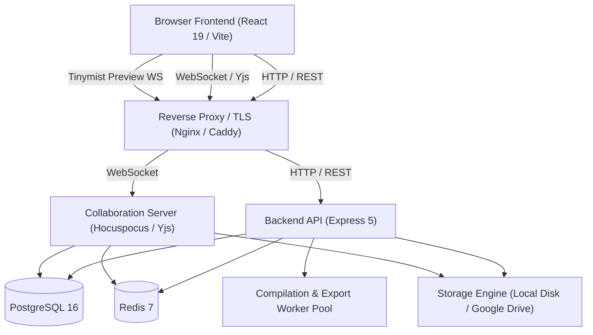

# Typstr Architecture

Typstr is a modern, collaborative, browser-based technical writing workspace for **Typst**, **LaTeX**, and markdown-style documents. It brings together real-time editing, WASM and server-side compilation pipelines, rich preview capabilities, reference management, tracked changes, and revision recovery.

---

## 1. System Architecture Overview

---

## 2. Runtime Components

### Frontend (`frontend/`)
- **Core Framework**: React 19, TypeScript, Vite.
- **Editor Engine**: CodeMirror 6 with `y-codemirror.next` for real-time CRDT synchronization.
- **Client-Side Compilation**:
  - **Typst WASM**: In-browser instant compilation using official Typst WASM toolchain.
  - **BusyTeX WASM**: WebAssembly TeX engine allowing zero-latency client-side LaTeX preview.
- **Preview & Rendering**:
  - TinyMist SVG/HTML preview streaming.
  - PDF.js viewer for compiled document preview.
  - SyncTeX bidirectional source-preview navigation.
- **Client State**: Lightweight React context with safe persistent local storage for UI preferences.

### Backend (`backend/`)
- **Application Server**: Express 5 on Node.js 20+ with TypeScript.
- **Authentication Providers**:
  - **LDAP / Active Directory**: Native LDAP client (`ldapts`) for enterprise user authentication with customizable search bases and attribute mappings.
  - **Google OAuth 2.0**: Sign-in with Google account integration and Drive authorization.
  - **ORCID OAuth**: Academic researcher profile authentication.
  - **Local Development Auth Bypass**: Instant session generation for local environments.
- **Collaboration Server**: Hocuspocus / Yjs WebSocket server managing room state, presence awareness, and persistence.
- **Database Layer**: PostgreSQL 16 storing users, projects, files, comments, invitations, activity logs, and revisions.
- **Caching & Job Queues**: Redis 7 powering sessions and BullMQ background task processing (compilation, export, retention).
- **Compilation Engine**:
  - Server-side `typst` CLI execution with caching.
  - `tinymist` language server and live preview process management.
  - `texlab` language server for LaTeX document diagnostics.
  - `pandoc` integration for multi-format document conversion (DOCX, HTML, Markdown).
- **Storage Abstraction**: Unified filesystem abstraction supporting both local disk storage (`LOCAL_FILE_STORAGE=true`) and Google Drive in cloud setups.

### Edge & Reverse Proxy
- **Nginx**: Handles static frontend asset serving, proxying `/api` REST requests, `/ws` WebSocket connections, and sticky routing for Tinymist preview streams.
- **Caddy (Optional)**: Provides automatic HTTPS TLS edge termination in production deployments.

---

## 3. Data & Storage Model

1. **Document Content & CRDT**:
   - Live collaborative editing flows through Yjs binary CRDT state updates via WebSockets.
   - Plain text document content is periodically synchronized and written to disk/Drive as standard source files.
2. **Revision History & Snapshots**:
   - File revision snapshots are created automatically on manual saves and major collaboration checkpoints.
   - Revisions include full content backups to ensure safe, conflict-free restores.
3. **Security & Secrets**:
   - User-provided AI API keys (OpenAI, Anthropic, Gemini) and OAuth tokens are encrypted at rest using AES-256-GCM with `TOKEN_ENCRYPTION_KEY`.
   - CSRF protection, secure cookie flags, and role-based permissions (Owner, Manager, Editor, Viewer) guard project resources.

---

## 4. Deployment Models

- **Local Development**: Fully self-contained stack with `docker compose -f docker-compose.yml -f docker-compose.dev.yml up --build`. No external accounts or cloud dependencies required.
- **Self-Hosted Production**: Deploy on any Linux host or VM using Docker Compose (`docker-compose.yml` + `docker-compose.prod.yml`) with Nginx and Caddy.
